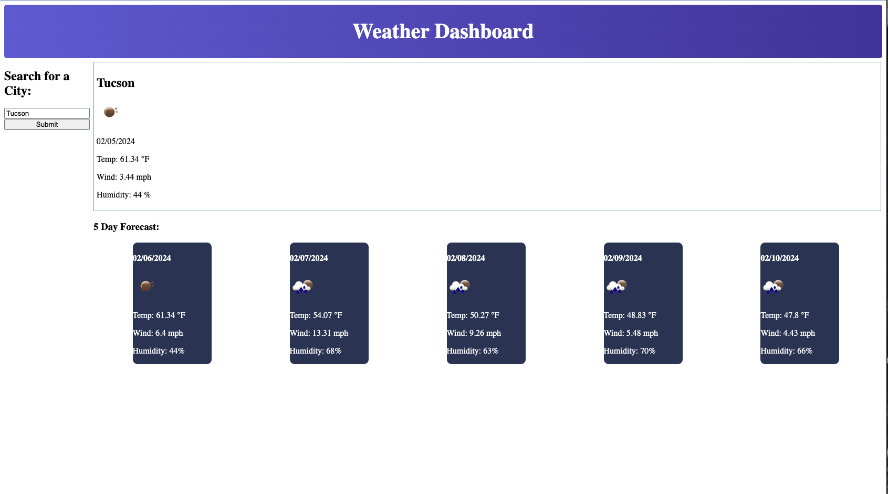

# weatherDashboard

This application displays weather information and forcast based on user input. Pick your city and see your 5 day forcast!

It uses HTML, CSS, Javascript, JQuery, dayjs, and OpenWeather.org API

[Link to deployed application](https://wellheytheremj.github.io/weatherDashboard/)

Contributions to code were made by tutor Bobbi Tarkany & Vinicius Z (Thank you! Much love!)